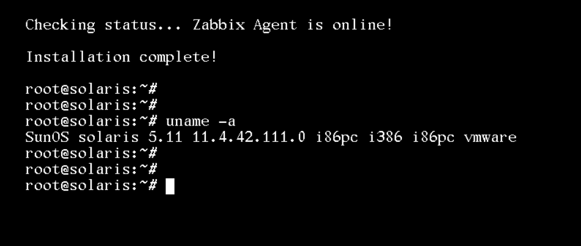
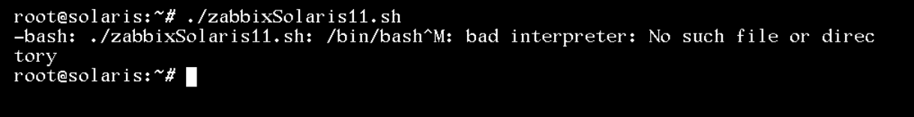

# Automated Zabbix Agent installation on Oracle Solaris 11

Shell Script created to automate installation of the Zabbix Agent on the Solaris 11 system with compatibility for x86-64 and SPARC architecture.

During installation you will be asked for the IP of the proxy or zabbix server and hostname for configuration.

<hr>

<h1 align="center">
    
</h1>

## Using the script [Do it as a root]:

Download the script:

```bash
# wget https://raw.githubusercontent.com/jeanrodrigop/zabbixSolaris11/main/zabbixSolaris11.sh
```

Change permission to execute:

```bash
# chmod +x zabbixSolaris11.sh
```

Execute the script:

```bash
# ./zabbixSolaris11.sh
```

## Known error:

<h1 align="center">
    
</h1>

The "bad interpreter: No such file or directory" error usually indicates that the script was created or edited on a Windows system, which uses different end-of-line characters (CRLF instead of LF). To fix this, you can remove these end-of-line characters with the following command:

```bash
# tr -d '\r' < zabbixSolaris11.sh > zabbixSolaris11_fixed.sh && mv zabbixSolaris11_fixed.sh zabbixSolaris11.sh
```

Change permission to again:

```bash
# chmod +x zabbixSolaris11.sh
```

Then run the script:

```bash
# ./zabbixSolaris11.sh
```

<hr>

Jean Rodrigo

